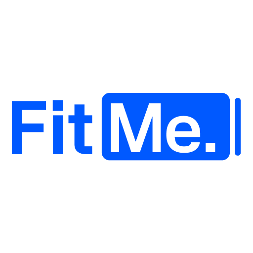

 

 
 

 
 

&nbsp;

 

---

## 📌 서비스 소개

> 흩어져 있는 장학금·공모전 정보를 한 곳에서,
> 내 조건(학교 / 거주지역 / 학점 / 관심분야)에 딱 맞게.

대학생을 위한 **장학금·공모전 자동 매칭** 모바일 웹 서비스입니다.

---

## 🛠 기술 스택

&nbsp;

&nbsp;

&nbsp;

&nbsp;

---

## 📦 Repositories

| | Repo | 설명 |
|:---:|:---:|:---|
| ⚛️ | [FitMe_front](https://github.com/FitMe-umc-10th/FitMe_front) | 프론트엔드 (React) |
| 🍃 | [FitMe_back](https://github.com/FitMe-umc-10th/FitMe_back) | 백엔드 (Spring Boot) |

---

## 👥 팀 구성

| 파트 | 이름 |
|:---:|:---|
| 🗂 PM | 이현수 |
| 🎨 디자인 | 김예진, 최수진 |
| ⚛️ Frontend | 서은호, 김경섭, 정종욱 |
| 🍃 Backend | 장문경, 김태리, 김강민, 육도연, 홍진우 |

 

